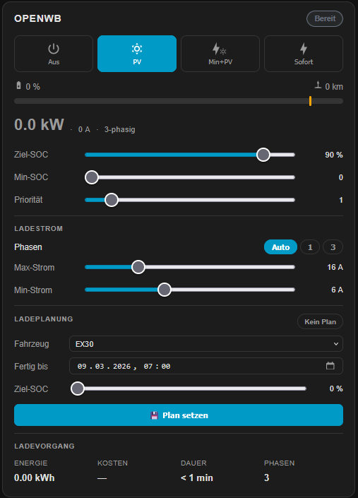
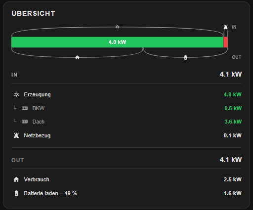
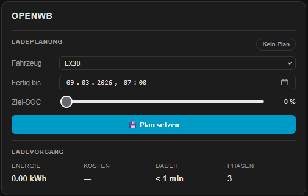
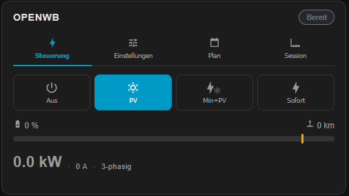

# EVCC Card for Home Assistant

[](https://github.com/hacs/integration)
[](LICENSE)

A custom Lovelace card for [Home Assistant](https://www.home-assistant.io/) that provides a comprehensive dashboard for [EVCC](https://evcc.io/) — the open-source EV charging controller — using the [ha-evcc integration](https://github.com/marq24/ha-evcc).

All charge points and site entities are **automatically discovered** based on the integration's entity naming scheme — no manual entity mapping required.

---

## Features

| Feature | Description |
|---|---|
| ☀️ **Site overview** | PV power bar split across home/charging/battery/feed-in, individual PV strings, live In/Out table |
| ⚡ **Charge mode control** | Switch between `Off`, `PV`, `Min+PV` and `Now` with a single tap |
| 🏠 **Home battery block** | Buffer SoC, priority SoC and discharge lock with inline sliders |
| 📑 **Compact mode** | Tab-based layout grouping controls, settings, plan and session — ideal for space-constrained dashboards |
| 📋 **Plan mode** | Minimalist mode showing only the charge plan — ideal for dedicated dashboard pages |
| 📅 **Charge planning** | Select vehicle, set target time & SoC, activate and delete plans |
| 📊 **Session overview** | Energy, cost, duration and phases of the current charging session |
| 🔍 **Auto-discovery** | Automatically detects all charge points and site entities — zero manual configuration |
| 🔋 **SoC display** | Vehicle state of charge as a progress bar with percentage and estimated range |
| 🎚️ **Slider controls** | Adjust Target SoC, Min SoC, Priority, Max current and Min current inline |
| 🔌 **Phase switching** | Auto / 1-phase / 3-phase control built in |
| 🌍 **Multi-language** | German, English and Spanish — auto-detected from HA language setting, easily extensible |
| 🔄 **Live updates** | Power, SoC and status update in real time without full re-render |
| 🎛️ **Filtering** | Select specific charge points via `loadpoints` config |

---

## Prerequisites

- [Home Assistant](https://www.home-assistant.io/) (2023.x or newer)
- [ha-evcc integration](https://github.com/marq24/ha-evcc) installed and configured
- A running [EVCC](https://evcc.io/) instance connected to Home Assistant

---

## Installation

### Via HACS (recommended)

1. Open **HACS** in Home Assistant
2. Go to **Frontend** → click the three-dot menu → **Custom repositories**
3. Add this repository URL and select category **Lovelace**
4. Search for **EVCC Card** and click **Install**
5. Reload your browser

### Manual installation

1. Download `evcc-card.js` and the `locales/` folder from the [latest release](../../releases/latest)
2. Copy them to `config/www/evcc-card/` in your Home Assistant instance, preserving the folder structure:

```
config/www/evcc-card/
├── evcc-card.js
└── locales/
    ├── index.json
    ├── de.json
    ├── en.json
    └── es.json
```

3. Add it as a Lovelace resource:

```yaml
# In your Lovelace resources (Settings → Dashboards → Resources)
url: /local/evcc-card/evcc-card.js
type: module
```

4. Reload your browser

---

## Configuration & Modes

Add the card to any Lovelace dashboard using the YAML editor. The `mode` option controls what the card displays.

### Configuration options

| Option | Type | Default | Description |
|---|---|---|---|
| `mode` | `string` | `loadpoint` | Card mode: `loadpoint`, `compact`, `battery`, `site`, `plan` |
| `loadpoints` | `list` | *(all)* | Filter charge points by name |
| `language` | `string` | *(auto)* | Override UI language: `en`, `de`, `es` |
| `no_plan` | `list` | *(none)* | Hide charge plan block for specific charge points |

---

### `loadpoint` (default)

The main charge point view. For each discovered charge point it shows:

- Charge mode buttons (Off / PV / Min+PV / Now)
- Vehicle SoC progress bar with percentage and estimated range
- Current charging session: energy, cost, duration, phases
- Sliders: Target SoC, Min SoC, Priority SoC, Min current, Max current
- Phase switch: Auto / 1-phase / 3-phase
- Charge plan block

```yaml
type: custom:evcc-card
```

```yaml
type: custom:evcc-card
loadpoints:
  - openwb          # show only specific charge points by name
  - wallbox-garage
```



---

### `site`

Full site energy overview:

- PV production bar split into: home consumption / charging / battery / feed-in
- Individual PV string values (e.g. BKW, Dach) shown as indented sub-rows
- Live power table with IN/OUT sections: Grid import/export, PV generation, home consumption, charging, battery
- Battery SoC shown inline in the charging/discharging row (e.g. `Battery charging – 47 %`)
- Active charge points shown as indented sub-rows under the charging row, including vehicle SoC or temperature

```yaml
type: custom:evcc-card
mode: site
```



---

### `battery`

Home battery management block:

- Current battery SoC with visual indicator
- Buffer SoC slider
- Priority SoC slider
- Discharge lock toggle

```yaml
type: custom:evcc-card
mode: battery
```


---

### `plan`

Minimalist charge plan view:

- Vehicle selector
- Target time picker
- Target SoC slider
- Activate / delete plan

```yaml
type: custom:evcc-card
mode: plan
loadpoints:
  - openwb
```



---

### `compact`

Same content as `loadpoint`, but organized into four tabs — ideal for dashboards where vertical space is limited or multiple charge points are shown side by side:

| Tab | Contents |
|---|---|
| ⚡ **Control** | Charge mode buttons, vehicle SoC bar, current charging power |
| 🎚️ **Settings** | Target SoC, Min SoC, Priority sliders, current limits, phase switch |
| 📅 **Plan** | Charge plan: vehicle selector, target time, target SoC, activate/delete |
| 📊 **Session** | Energy, cost, duration and phases of the current session |

The selected tab is remembered per charge point across re-renders.

```yaml
type: custom:evcc-card
mode: compact
```

```yaml
type: custom:evcc-card
mode: compact
loadpoints:
  - openwb          # show only specific charge points by name
  - wallbox-garage
```



---

### Override language

```yaml
type: custom:evcc-card
language: en   # or: de, es
```

---

## Icons

All icons throughout the card use inline [Material Design Icons](https://pictogrammers.com/library/mdi/) (MDI) rendered as embedded SVG paths — no external icon font, no `ha-icon` dependency, no `foreignObject`. This ensures correct rendering in all HA themes and browsers.

Key icon assignments:

| Element | Icon |
|---|---|
| PV generation | `mdi:white-balance-sunny` |
| PV sub-source (string) | `mdi:solar-panel` |
| Battery | `mdi:battery-charging-50` |
| Grid import / export | `mdi:transmission-tower` |
| Home consumption | `mdi:home` |
| Charge point | `mdi:ev-station` |
| Heat pump (°C loadpoint) | `mdi:thermometer-low` |
| Mode: Off | `mdi:power` |
| Mode: PV | `mdi:white-balance-sunny` |
| Mode: Min+PV | `mdi:lightning-bolt` &amp; `mdi:white-balance-sunny` (combined) |
| Mode: Now | `mdi:lightning-bolt` |

---

## Translations

The card ships with **German**, **English** and **Spanish** and automatically uses the language configured in Home Assistant. You can override it per card via the `language` config option.

Translations are stored as simple JSON files in the `locales/` folder. Adding a new language takes only two steps:

1. Create a new file `locales/<lang>.json` by copying an existing one (e.g. `en.json`) and translating the values
2. Add the language code to `locales/index.json`

```json
["de", "en", "es", "fr"]
```

That's it — no changes to `evcc-card.js` required.

**Want to contribute a translation?** Pull requests for new languages are very welcome! Have a look at [`locales/en.json`](locales/en.json) as a starting point and open a PR with your new language file.

---

## Entity naming scheme

This card relies on the entity naming convention used by [ha-evcc](https://github.com/marq24/ha-evcc). Entities follow the pattern:

```
sensor.evcc_<loadpoint_name>_<entity_type>
select.evcc_<loadpoint_name>_mode
number.evcc_<loadpoint_name>_limit_soc
...
```

As long as you use the standard ha-evcc integration, no additional configuration is needed — the card discovers all entities automatically.

---

## Contributing

Pull requests are welcome! Please open an issue first to discuss what you'd like to change.

1. Fork the repository
2. Create a feature branch: `git checkout -b feature/my-feature`
3. Commit your changes: `git commit -m 'Add my feature'`
4. Push to the branch: `git push origin feature/my-feature`
5. Open a Pull Request

Contributions that are especially appreciated:

- 🌍 **New translations** — see the [Translations](#translations) section above
- 🐛 **Bug reports and fixes**
- 💡 **Feature suggestions and implementations**

---

## License

[MIT](LICENSE)

---

## Related projects

- [EVCC](https://evcc.io/) — the EV charging controller this card is built for
- [ha-evcc](https://github.com/marq24/ha-evcc) — the Home Assistant integration providing all entities